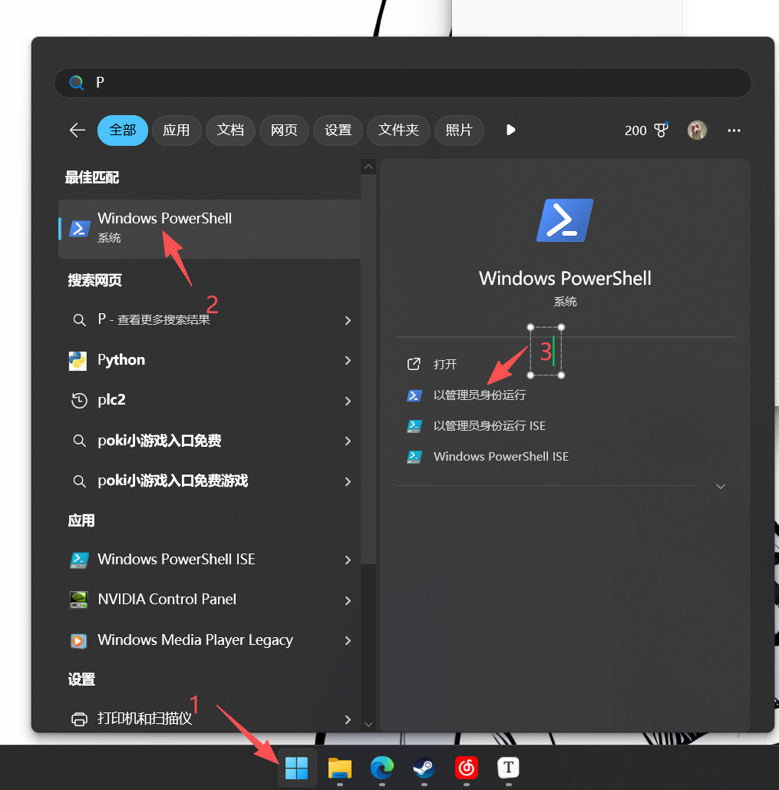
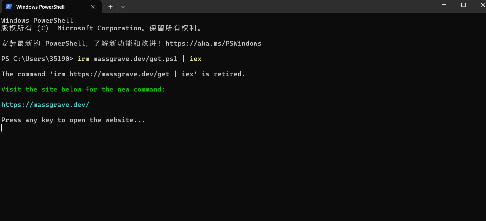
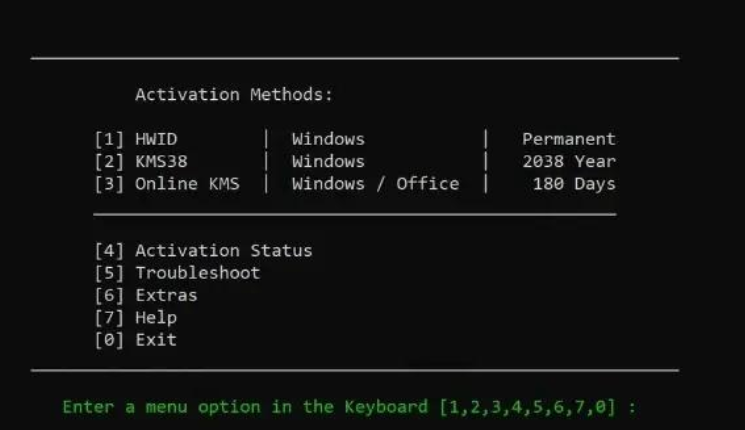

# windows11激活指北
##  1.win+s打开搜索界面，搜索powershell



## 2.运行激活脚本

```
irm massgrave.dev/get.ps1 | iex
```



## 3.选择激活项目

### 1.永久激活

### 2.激活到2038年

### 3.激活180天

（一般就输入1永久激活）

### 

注意事项

1.激活过程请保持网络良好

2.运行power shell时请以管理员身份运行，否则可能无法运行脚本
